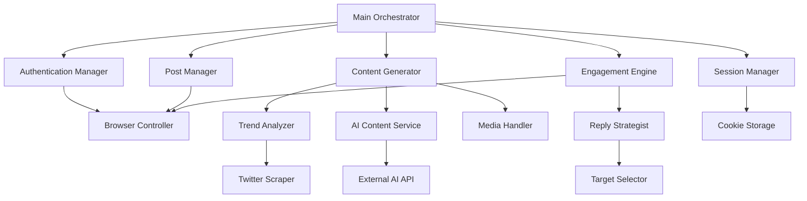
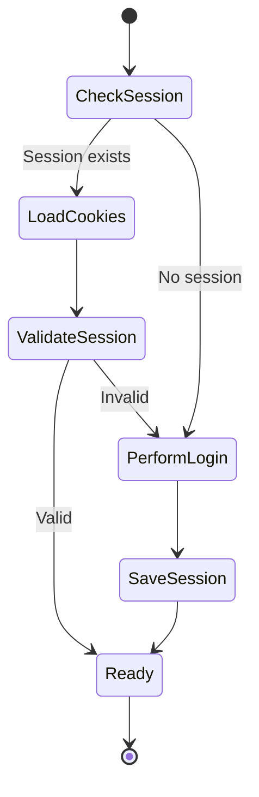
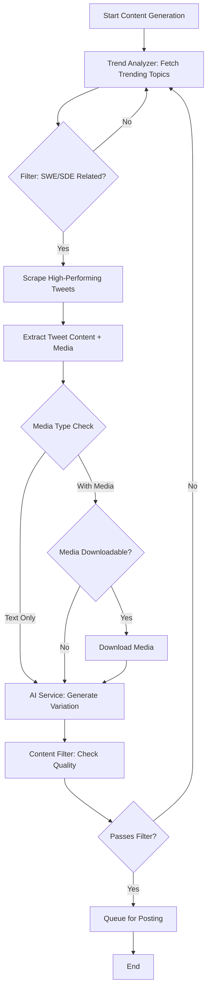
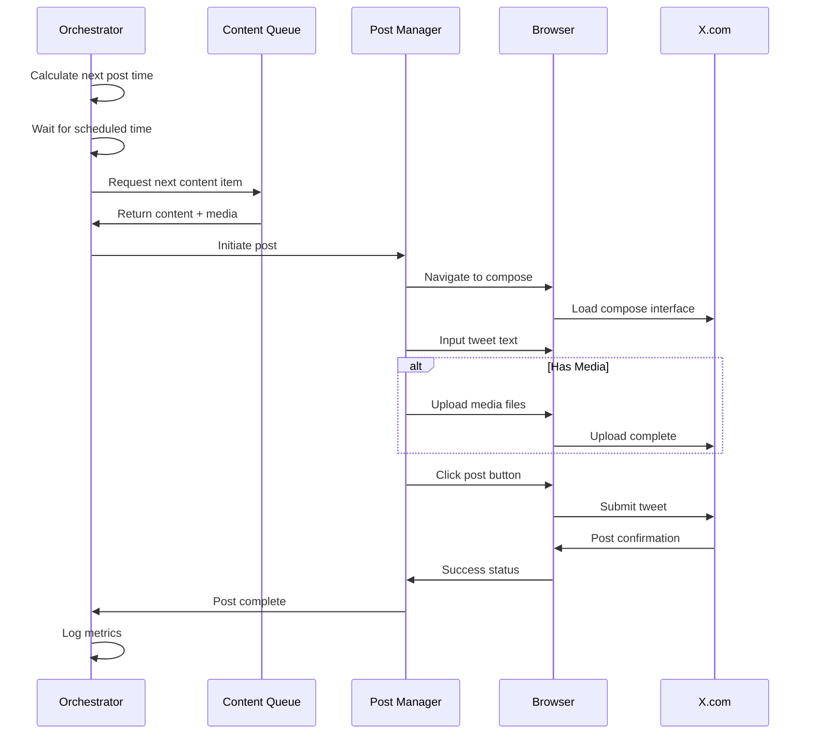
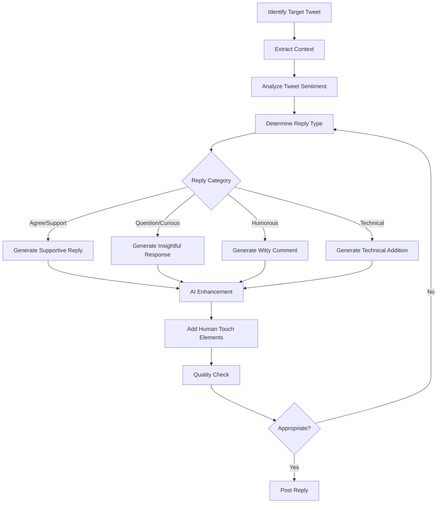
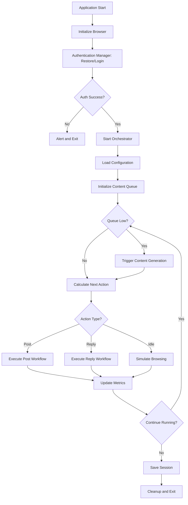
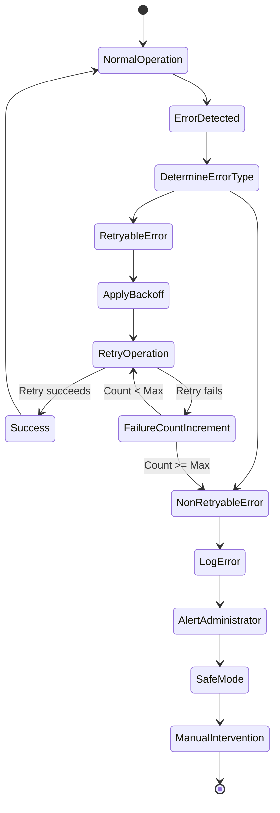

# Twitter Automation Application Design

## 1. Overview

### 1.1 Purpose
This application automates Twitter/X.com interactions to create, post, and engage with content focused on software development topics. The system leverages browser automation to simulate human-like behavior while maintaining high engagement rates through AI-generated content and strategic reply mechanisms.

### 1.2 Core Capabilities
- Automated authentication and session management on X.com
- AI-driven content generation based on trending developer topics
- Intelligent content curation through tweet scraping and media handling
- Strategic reply generation to maximize engagement
- Human-like behavioral patterns to avoid detection

### 1.3 Technology Foundation
- **Browser Automation**: Playwright framework (cross-browser support, modern API, reliable)
- **AI Integration**: Hybrid approach combining external AI APIs with trend analysis
- **Content Strategy**: Developer/SWE/SDE focused topics, excluding cryptocurrency
- **Session Persistence**: Cookie-based authentication with reusable sessions

## 2. System Architecture

### 2.1 Component Overview

### 2.2 Component Responsibilities

| Component | Responsibility | Key Functions |
|-----------|---------------|---------------|
| Main Orchestrator | Coordinates all operations and scheduling | Task scheduling, workflow control, error recovery |
| Authentication Manager | Handles login and session validation | Session restoration, credential management, auth verification |
| Content Generator | Creates tweet content and manages media | Trend analysis, AI generation, content filtering, media processing |
| Post Manager | Publishes tweets to X.com | Tweet posting, rate limiting, post verification |
| Engagement Engine | Manages reply activities | Timeline monitoring, reply generation, engagement tracking |
| Session Manager | Maintains browser session persistence | Cookie save/load, session validation, storage management |
| Browser Controller | Low-level browser automation | Page navigation, element interaction, screenshot capture |

## 3. Functional Design

### 3.1 Authentication and Session Management

#### 3.1.1 Session Lifecycle

#### 3.1.2 Authentication Strategy
- **Primary Method**: Load saved cookies and restore session
- **Session Validation**: Verify authentication by checking profile access or home feed
- **Session Storage**: Persist cookies and local storage data in encrypted format
- **Fallback**: If session restoration fails, trigger fresh login flow
- **Security Considerations**: Store credentials in environment variables or secure configuration

#### 3.1.3 Session Persistence Data
| Data Type | Purpose | Storage Location |
|-----------|---------|------------------|
| Cookies | Authentication tokens | Encrypted file in config directory |
| Local Storage | User preferences and session data | JSON file linked to browser profile |
| Browser Profile | Cached data and settings | Dedicated profile directory |
| Auth Timestamp | Session validity tracking | Metadata file |

### 3.2 Content Generation System

#### 3.2.1 Content Generation Workflow

#### 3.2.2 Trend Analysis Strategy
- **Source Identification**: Monitor "Trending" section, "For You" timeline, and specific developer influencer accounts
- **Topic Filtering**: Focus on software engineering, programming languages, developer tools, tech career, coding memes
- **Exclusion Rules**: Reject crypto, finance, political, controversial topics
- **Engagement Metrics**: Prioritize tweets with high like/retweet ratios from the past 6-24 hours
- **Freshness Balance**: Mix recent trends (60%) with evergreen developer content (40%)

#### 3.2.3 AI Content Generation Approach
- **Hybrid Model**: Combine trend analysis with AI-powered content variation
- **AI Service Integration**: Connect to external AI API (OpenAI GPT, Anthropic Claude, or similar)
- **Generation Process**:
  - Input: Original tweet text, engagement metrics, topic context
  - Prompt Engineering: Instruct AI to create variations maintaining tone and intent
  - Output: Multiple variations for selection
- **Template Enhancement**: Use templates for common patterns (tips, humor, observations) enhanced by AI
- **Human Touch**: Inject personality markers, casual language, occasional typos for authenticity

#### 3.2.4 Media Handling Strategy

**Phase 1: Initial Implementation (Text + Image)**
- Download images and GIFs from source tweets
- Store media temporarily in local cache
- Re-upload during posting process
- Support formats: JPEG, PNG, GIF, WebP

**Phase 2: Enhanced Media Support**
| Media Type | Handling Approach | Priority |
|------------|-------------------|----------|
| Images (memes) | Download and re-upload | High |
| GIFs | Download and re-upload | High |
| Videos (short) | Download if under 50MB, otherwise skip | Medium |
| Multiple images | Support up to 4 images per tweet | Medium |
| External links | Preserve original link with preview | Low |

**Media Filtering Rules**:
- Only use media marked as freely available or from retweet-friendly creators
- Avoid copyrighted logos, branded content without permission
- Filter out NSFW or inappropriate content through basic image analysis
- Verify media dimensions meet Twitter specifications

#### 3.2.5 Content Quality Filters
| Filter Type | Criteria | Action |
|-------------|----------|--------|
| Length Check | 10-280 characters | Reject if outside range |
| Spam Detection | Excessive hashtags, repeated words | Regenerate |
| Relevance Score | Developer topic match > 70% | Reject if below threshold |
| Originality Check | Similarity to recent posts < 80% | Regenerate |
| Tone Analysis | Professional yet casual | Adjust if too formal/informal |

### 3.3 Posting Strategy

#### 3.3.1 Posting Schedule
- **Timing Pattern**: Random intervals between 90-240 minutes (1.5 to 4 hours)
- **Daily Volume**: Target 6-10 posts per day
- **Peak Hours Weighting**: Higher probability during typical developer active hours (9-11 AM, 2-4 PM, 8-10 PM in target timezone)
- **Weekend Adjustment**: Reduced frequency and shifted timing
- **Rate Limiting**: Built-in cooldown periods to avoid platform restrictions

#### 3.3.2 Posting Process Flow

#### 3.3.3 Post Verification
- **Confirmation Check**: Verify tweet appears on profile page
- **Error Handling**: Detect rate limits, content warnings, posting failures
- **Retry Logic**: Attempt up to 2 retries with exponential backoff
- **Logging**: Record post ID, timestamp, content hash, engagement baseline

### 3.4 Engagement and Reply System

#### 3.4.1 Reply Target Selection

**Selection Strategy: Hybrid (High-Engagement + Keyword Match)**
- **Timeline Monitoring**: Scan "Home" and "For You" feeds every 10-15 minutes
- **Filtering Criteria**:
  - Account has > 500 followers OR verified status
  - Tweet has > 100 likes OR > 20 retweets
  - Contains SWE/developer-related keywords
  - Posted within last 6 hours
  - Not already replied to by this account
- **Randomization**: Shuffle qualifying tweets and select randomly to avoid patterns
- **Daily Reply Target**: 15-30 replies distributed throughout the day

#### 3.4.2 Reply Generation Logic

#### 3.4.3 Reply Content Strategy
- **AI-Powered Generation**: Use AI API to generate contextual replies based on original tweet
- **Reply Templates**: Maintain library of response patterns (agreement, questions, insights, humor)
- **Human Touch Elements**:
  - Occasional grammatical variations
  - Casual language and abbreviations
  - Emoji usage (sparingly, 0-2 per reply)
  - Variable length (10-150 characters typically)
- **Engagement Optimization**: Replies should add value, ask questions, or express relatable sentiments

#### 3.4.4 Reply Quality Filters
| Criterion | Requirement | Purpose |
|-----------|-------------|---------|
| Relevance | Directly related to original tweet | Avoid off-topic spam |
| Length | 10-280 characters, typically under 150 | Maintain readability |
| Tone Match | Align with original tweet sentiment | Natural conversation flow |
| Value Addition | Provide insight, humor, or validation | Encourage engagement |
| Spam Check | No excessive links, hashtags, or mentions | Avoid platform flags |

#### 3.4.5 Engagement Timing
- **Reply Frequency**: 1-3 replies per hour during active periods
- **Interleaving**: Distribute replies between original posts
- **Cooldown**: 5-15 minute wait after each reply
- **Batch Avoidance**: Never reply to multiple tweets in rapid succession

### 3.5 Human-Like Behavior Simulation

#### 3.5.1 Behavioral Patterns
| Behavior | Implementation | Purpose |
|----------|---------------|---------|
| Mouse Movement | Random cursor movements during page interaction | Mimic natural browsing |
| Scroll Patterns | Variable speed scrolling with pauses | Simulate reading |
| Typing Speed | 40-80 WPM with occasional pauses | Natural text entry |
| Click Delays | 200-800ms delays before clicks | Human reaction time |
| Session Duration | 10-30 minute active sessions with breaks | Natural usage pattern |
| Navigation Variety | Browse between compose, timeline, profile | Avoid robotic focus |

#### 3.5.2 Anti-Detection Measures
- **Randomized Intervals**: All timing includes random variance
- **User Agent Consistency**: Maintain realistic browser fingerprint
- **Viewport Variation**: Occasionally resize browser window slightly
- **Activity Breaks**: 30-60 minute idle periods every 3-4 hours
- **Error Simulation**: Occasionally abandon compose or cancel actions
- **Reading Time**: Spend time on timeline before posting/replying

## 4. Data Models

### 4.1 Tweet Content Record
| Field | Type | Description |
|-------|------|-------------|
| content_id | String (UUID) | Unique identifier for content item |
| text | String | Tweet text content |
| media_urls | Array[String] | URLs of associated media |
| media_local_paths | Array[String] | Local file paths after download |
| source_tweet_id | String | Original tweet ID if scraped |
| source_author | String | Original author handle |
| topic_tags | Array[String] | Categorization tags |
| engagement_score | Number | Predicted engagement potential |
| generation_timestamp | DateTime | When content was created |
| status | Enum | queued, posted, failed |

### 4.2 Posted Tweet Record
| Field | Type | Description |
|-------|------|-------------|
| post_id | String | Twitter-assigned tweet ID |
| content_id | String | Reference to content record |
| posted_timestamp | DateTime | When tweet was published |
| initial_likes | Number | Engagement snapshot at 1 hour |
| initial_retweets | Number | Engagement snapshot at 1 hour |
| final_engagement | Object | Engagement after 24 hours |

### 4.3 Reply Record
| Field | Type | Description |
|-------|------|-------------|
| reply_id | String | Twitter-assigned reply ID |
| target_tweet_id | String | Original tweet being replied to |
| target_author | String | Author of original tweet |
| reply_text | String | Reply content |
| reply_timestamp | DateTime | When reply was posted |
| engagement_metrics | Object | Reply performance data |

### 4.4 Session State
| Field | Type | Description |
|-------|------|-------------|
| session_id | String | Unique session identifier |
| cookies | Array[Object] | Browser cookies |
| local_storage | Object | Browser local storage data |
| last_validated | DateTime | Last successful validation |
| auth_status | Boolean | Current authentication state |
| profile_data | Object | User profile information |

## 5. Configuration and Parameters

### 5.1 System Configuration
| Parameter | Default Value | Description |
|-----------|---------------|-------------|
| browser_type | chromium | Playwright browser (chromium, firefox, webkit) |
| headless_mode | false | Run browser in headless mode |
| session_file_path | ./config/session.enc | Encrypted session storage location |
| media_cache_path | ./cache/media | Temporary media storage |
| content_queue_size | 20 | Number of pre-generated posts to maintain |
| max_retries | 3 | Maximum retry attempts for failed operations |

### 5.2 Content Generation Settings
| Parameter | Default Value | Description |
|-----------|---------------|-------------|
| ai_api_provider | openai | AI service provider |
| ai_model | gpt-4 | Specific model version |
| ai_temperature | 0.7 | Creativity level (0-1) |
| trend_fetch_interval | 60 minutes | How often to refresh trending topics |
| content_generation_batch | 5 | Number of posts to generate per batch |
| media_max_size | 5 MB | Maximum media file size |
| min_engagement_threshold | 100 | Minimum likes for source tweets |

### 5.3 Posting Schedule Settings
| Parameter | Default Value | Description |
|-----------|---------------|-------------|
| min_post_interval | 90 minutes | Minimum time between posts |
| max_post_interval | 240 minutes | Maximum time between posts |
| daily_post_target | 8 | Target number of posts per day |
| peak_hours | [9-11, 14-16, 20-22] | Hour ranges for increased activity |
| weekend_frequency_multiplier | 0.7 | Reduce posting on weekends |

### 5.4 Engagement Settings
| Parameter | Default Value | Description |
|-----------|---------------|-------------|
| daily_reply_target | 20 | Target number of replies per day |
| min_reply_interval | 5 minutes | Minimum time between replies |
| max_reply_interval | 30 minutes | Maximum time between replies |
| min_target_followers | 500 | Minimum follower count for reply targets |
| reply_ai_temperature | 0.8 | Creativity for reply generation |

### 5.5 Behavior Simulation Settings
| Parameter | Default Value | Description |
|-----------|---------------|-------------|
| typing_speed_wpm | 60 | Average typing speed |
| typing_variance | 20 | WPM variance (+/-) |
| mouse_movement_enabled | true | Enable random mouse movements |
| scroll_behavior | smooth | Scrolling pattern (smooth, instant, auto) |
| session_duration_min | 15 minutes | Minimum active session length |
| session_duration_max | 45 minutes | Maximum active session length |
| break_duration_min | 30 minutes | Minimum idle time between sessions |
| break_duration_max | 90 minutes | Maximum idle time between sessions |

## 6. Operational Workflows

### 6.1 Main Application Loop

### 6.2 Daily Cycle Pattern

```mermaid
gantt
    title Typical 24-Hour Activity Pattern
    dateFormat HH:mm
    axisFormat %H:%M
    
    section Morning
    Session 1 - Browse & Post    :a1, 08:00, 30m
    Reply Activity              :a2, 08:35, 15m
    Idle Break                  :a3, 08:50, 40m
    Session 2 - Post & Engage   :a4, 09:30, 25m
    
    section Midday
    Idle Break                  :b1, 09:55, 90m
    Session 3 - High Activity   :b2, 11:25, 35m
    Reply Burst                 :b3, 12:00, 20m
    
    section Afternoon
    Long Break                  :c1, 12:20, 110m
    Session 4 - Post & Reply    :c2, 14:10, 30m
    Browse Timeline             :c3, 14:40, 15m
    Idle Break                  :c4, 14:55, 60m
    
    section Evening
    Session 5 - Peak Activity   :d1, 15:55, 40m
    Post Content                :d2, 16:35, 10m
    Idle Break                  :d3, 16:45, 75m
    Session 6 - Engage          :d4, 18:00, 35m
    
    section Night
    Extended Break              :e1, 18:35, 95m
    Session 7 - Final Post      :e2, 20:10, 25m
    Light Engagement            :e3, 20:35, 20m
    Overnight Idle              :e4, 20:55, 660m
```

### 6.3 Error Handling Strategy

#### 6.3.1 Error Categories and Responses
| Error Type | Detection Method | Recovery Action | Escalation |
|------------|------------------|-----------------|------------|
| Authentication Failure | Session validation fails | Re-login attempt | Alert after 3 failures |
| Rate Limiting | HTTP 429 or UI warning | Exponential backoff (1-4 hours) | Log and pause activity |
| Content Policy Violation | Post blocked warning | Skip content, mark source | Review content filters |
| Network Timeout | Request timeout | Retry with increased timeout | Alert after 5 failures |
| Element Not Found | Selector fails | Wait and retry, update selectors | Alert after layout changes |
| Browser Crash | Process exit | Restart browser, restore session | Alert after 3 crashes |

#### 6.3.2 Recovery Procedures

### 6.4 Monitoring and Logging

#### 6.4.1 Metrics to Track
| Metric Category | Specific Metrics | Purpose |
|-----------------|------------------|---------|
| Content Performance | Posts per day, average engagement, viral rate | Optimize content strategy |
| Reply Effectiveness | Reply count, reply engagement, conversation rate | Improve reply quality |
| System Health | Uptime, error rate, recovery success rate | Maintain reliability |
| Authentication | Session duration, re-auth frequency | Optimize session management |
| Behavioral Analysis | Action timing distribution, pattern variance | Enhance human-like behavior |

#### 6.4.2 Logging Levels
- **DEBUG**: Detailed browser actions, element interactions, timing data
- **INFO**: Major workflow steps, content generation, post/reply events
- **WARN**: Recoverable errors, rate limiting, content filtering
- **ERROR**: Authentication failures, unrecoverable errors, system crashes
- **CRITICAL**: Security issues, repeated failures, manual intervention required

#### 6.4.3 Logging Output Structure
| Field | Description | Example |
|-------|-------------|---------|
| timestamp | ISO 8601 timestamp | 2024-01-15T14:23:45.123Z |
| level | Log level | INFO |
| component | System component | ContentGenerator |
| action | Specific action | generate_tweet |
| status | Outcome | success |
| details | Additional context | Generated tweet about React hooks |
| metrics | Performance data | duration_ms: 1234 |

## 7. Security and Privacy Considerations

### 7.1 Credential Management
- Store all credentials in environment variables or encrypted configuration files
- Never log or expose authentication tokens in plaintext
- Use secure storage mechanisms for session cookies
- Implement automatic credential rotation capability for long-term operation

### 7.2 Data Protection
- Encrypt session files using AES-256 encryption
- Secure media cache with appropriate file permissions
- Implement secure deletion for temporary media files
- Avoid storing personally identifiable information from scraped content

### 7.3 Content Safety
- Implement content filtering to avoid posting inappropriate material
- Maintain blocklist of prohibited terms and topics
- Verify media content appropriateness before posting
- Respect intellectual property by only using free-to-use content

### 7.4 Platform Compliance
- Implement rate limiting to stay within platform guidelines
- Add circuit breakers to stop operation if unusual patterns detected
- Monitor for policy changes and adapt behavior accordingly
- Maintain ethical usage aligned with training/research purpose

## 8. Deployment and Execution

### 8.1 System Requirements
| Component | Minimum Requirement | Recommended |
|-----------|---------------------|-------------|
| Operating System | Windows 10, macOS 11, Linux (Ubuntu 20.04+) | Latest stable version |
| RAM | 4 GB | 8 GB |
| Storage | 2 GB available | 10 GB for media cache |
| Network | Stable internet connection | Broadband (10+ Mbps) |
| Runtime | Node.js 16+ or Python 3.9+ | Latest LTS version |

### 8.2 Dependencies
- Playwright (browser automation framework)
- AI API client library (OpenAI SDK, Anthropic SDK, or similar)
- Encryption library for session storage
- HTTP client for API requests
- Image processing library for media handling
- Configuration management library
- Logging framework

### 8.3 Execution Modes
| Mode | Description | Use Case |
|------|-------------|----------|
| Continuous | Runs indefinitely with configured schedule | Production deployment |
| Single-Cycle | Executes one complete posting cycle and exits | Testing, scheduled tasks |
| Content-Only | Generates content without posting | Content review/approval workflow |
| Dry-Run | Simulates all actions without actual posting | Testing and validation |

### 8.4 Configuration Management
- Use environment-specific configuration files (dev, staging, production)
- Support configuration override via environment variables
- Validate all configuration parameters on startup
- Provide configuration templates for easy setup

## 9. Future Enhancements

### 9.1 Short-Term Improvements
- Enhanced media support (video clips, carousels)
- Sentiment analysis for better content targeting
- A/B testing framework for content variations
- Analytics dashboard for performance monitoring
- Thread creation capability for longer-form content

### 9.2 Medium-Term Enhancements
- Multi-account management support
- Engagement analytics and feedback loop
- Custom AI model fine-tuning on successful content
- Integration with developer news aggregators
- Automated hashtag optimization

### 9.3 Long-Term Vision
- Cross-platform support (LinkedIn, Mastodon, Bluesky)
- Community building features (DM responses, follower engagement)
- Content calendar and strategic planning tools
- Collaboration features for content creators
- Advanced analytics and performance prediction- Collaboration features for content creators
